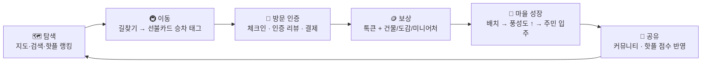

# 톡타운(TokTown) 기획서 — 현행 구현 역정리

| 항목 | 내용 |
|---|---|
| 문서 성격 | 현재 구현된 데모(코드)를 기준으로 역방향 정리한 기획서 |
| 문서 버전 | v1.1 — 앱 전역 언어 모드(한/영) 반영 |
| 기준 버전 | `main`+피드백 반영 빌드 (M1~M5 완료 + 언어 모드, 2026-08-14) |
| 원 기획 문서 | `toktown_기획문서_v1.7` · `toktown_구현브리프` (이 문서는 그 결과물의 현행판 스냅샷) |
| 데모 형태 | 브라우저 실행 웹앱 — 데스크톱 화면 중앙 모바일 프레임(390×844) + 프레임 밖 평가용 데모 컨트롤 패널 |

---

## 1. 서비스 개요

### 1.1 한 줄 정의

> 결제 서비스 '톡페이'의 확장 생태계. **지도로 동네를 발견하고, 실제로 다녀오면 나만의 마을이 자라나는** 로컬 라이프 타운.

### 1.2 핵심 컨셉 — 이중 공간

| 공간 | 역할 | 표현 |
|---|---|---|
| **현실 공간 (지도)** | 발견·이동·방문·결제 — 실제 행동이 일어나는 곳 | 실지도(명동 도보권) + 톡타운 아트스타일 SVG 마커 오버레이 |
| **가상 공간 (내 마을)** | 현실 행동의 결과가 쌓이는 보상 공간 | '동물의숲' 풍 26×26 타일 2.5D 캔버스 월드 |

**"현실에서 얻고, 마을에 쌓인다"** — 획득(방문 인증·조우·발견·구매)은 현실 행동으로만 일어나고, 마을에는 그 결과물(건물·이웃·미니어처·소품)을 수동으로 배치한다.

### 1.3 실물 연결 — 톡페이 선불카드

- 기존 서비스에서 사용하던 **톡페이 선불카드**를 그대로 사용 (별도 실물 굿즈 없음)
- **폰에 갖다 대면(NFC) 톡페이 잔액 → 카드 교통 잔액 즉시 충전**
- 대중교통 **승차 태그** 시 요금 차감 + 톡큰 적립 → 온·오프라인 연결 고리

### 1.4 타깃

- 로컬 주민: 동네 노포·히든 스팟 발견, 방문 기록의 게임화
- 방한 외국인: 언어 장벽 없는 탐색 (리뷰·커뮤니티 한↔영 번역, 넌버벌 콘텐츠 추천)
- 데모 데이터의 리뷰 34건·커뮤니티 글 8건이 한/영 혼합으로 구성된 이유

### 1.5 글로벌 UX 원칙 — 앱 전역 언어 모드 (한/영)

서비스 출발점이 **외국인 대상**이므로, 특정 화면의 번역 기능이 아니라 **앱 전체가
한국어/영어 두 모드로 동작**한다. 상세는 §4.14 — 요약:

- 상태바 영역(노치 옆)의 **한 | EN 전역 토글** — 온보딩 첫 화면부터 노출, 즉시 전환
- UI 문자열·시드 콘텐츠(매장/NPC/이벤트)·NPC 대사·캔버스 라벨·지도 마커까지 전부 전환
- 리뷰·커뮤니티 글(UGC)은 **앱 언어와 일치하는 버전을 기본 표시** + 원문/번역 토글
- 매장 검색은 한/영 어느 표기로도 매칭 (예: `미성옥` = `Miseongok`)

---

## 2. 핵심 루프



모든 지급 행동에는 **어뷰징 방지 검증**이 선행된다: `이동속도(비현실적 점프) → 반경 100m → 1일 1회 → 지급`.

---

## 3. 화면 구조 (IA)

```
온보딩 (최초 1회)
 └ 캐릭터 커스터마이징 → 닉네임 → 주민증 발급 연출 → 촌장(부엉) 튜토리얼
메인 셸 — 하단 4탭
 ├ 🗺️ 지도      : 검색 오버레이 · 카테고리 칩 · 매장 상세 시트 · 핫플 랭킹 시트
 │               · 저장 목록 · NPC 조우 모달 · 여정 오버레이(태그 대기→탑승→추적→도착)
 ├ 💬 커뮤니티  : 통합 피드 · 태그 필터 · 검색 · 글 상세(댓글) · 글 작성
 ├ 🏡 내 마을    : 걷는 월드(캔버스) · 대화 오버레이 · 배치 모드(보관함)
 │               · 주민증 / 도감 / 상점 / 꾸미기 모달
 └ 💳 지갑       : 톡페이 잔액 · 톡페이 선불카드(교통 잔액) · 톡큰 내역
공통 : 🌐 한/EN 언어 토글(상태바 영역, 전 화면 상시) · 출석 팝업 · 토스트
       · (프레임 밖) 데모 컨트롤 패널
```

---

## 4. 주요 기능 상세

### 4.1 온보딩 · 주민 등록

| 요소 | 사양 |
|---|---|
| 캐릭터 파츠 | 피부 4톤 · 헤어 4스타일(단발/숏컷/긴머리/번헤어) × 6색 · 의상 3종(티셔츠/후드/멜빵바지) × 6색 |
| 랜덤 주사위 | 파츠 랜덤 조합 버튼 제공 |
| 주민증 발급 | 닉네임 입력 → 발급 연출 → `주민증` 모달에서 상시 확인 (방문 지역 뱃지 포함) |
| 튜토리얼 | 촌장 부엉의 동숲풍 대화로 세계관·루프 안내 |
| 계정 | 로그인 없음 — 프로필은 localStorage 저장, 이후 `꾸미기`에서 파츠 재편집 가능 |

### 4.2 지도 탐색

- **지도**: Leaflet + **CARTO 무라벨 래스터 타일** (매장 POI 아이콘·라벨 없음 — 매장 표시는 톡타운 자체 마커가 전담). 타일 서버 접근 불가 환경(웹 공유 샌드박스·사내 프록시)에서는 **코드 생성 종이 질감 배경**으로 자동 폴백. 초기 중심 명동(줌 16), 줌 13~19, 이동 범위 서울 도심으로 제한.
- **마커 (전부 코드 생성 SVG)**

| 마커 | 수량 | 동작 |
|---|---|---|
| 매장 핀 | 10 | 카테고리별 색/아이콘, 저장 시 ❤️ 표시, 탭 → 상세 시트 |
| 지역 NPC (까치 까미) | 하루 2지점 | 출몰 지점 4곳 중 날짜 기반 로테이션, 탭 → 조우 모달 |
| 랜드마크 | 4 | 미니어처 실루엣 + 상시 이름 라벨 |
| 내 캐릭터 | 1 | 가상 GPS 위치, 이동 중 경로 추적 애니메이션 |

- **검색**: 자동완성 + 최근 검색 저장, 매장명/카테고리 검색
- **카테고리 칩**: 맛집 / 카페 / 저장 / 이벤트 필터
- **매장 상세 시트**: 혜택 뱃지 · 영업시간 · 소개 · 태그 · 주민 리뷰(방문 인증 뱃지, 한↔영 번역 보기) · ❤️ 저장 · 길찾기 · 체크인/리뷰/결제 버튼
- **저장 장소**: 저장 목록 화면 → 지도에서 보기

### 4.3 이동(여정) · 승차 태그

```
길찾기 → 경로 후보 3종 → 이동 시작 → [승차 태그 대기] → 태그 → 탑승 애니메이션(2.8초)
      → 실지도 경로 추적(캐릭터가 폴리라인 따라 이동) → 진행 85% 하차 알림 → 도착 모달 → 체크인 유도
```

| 경로 후보 | 노선(목업) | 요금 | 비고 |
|---|---|---|---|
| 지하철 | 4호선 (명동/회현/을지로입구역) | 1,500원 | 승·하차역 자동 선택 |
| 버스 | 광역 0212 (정류장 3곳) | 1,500원 | |
| 도보 | — | 0원 | 거리 기반 소요 시간(67m/분) |

- **승차 태그**: 실서비스에선 선불카드 태그 이벤트 실시간 수신(교통 제휴사 데이터). 데모는 폴백 트리거 구조(패널 버튼)를 그대로 재현. 태그 시 **교통 잔액 1,500원 차감 + 톡큰 +5**, 잔액 부족 시 지갑 충전 유도.
- 경로는 사전 정의 폴리라인(베지어 보간) — 실서비스 전환 시 대중교통 API 라우팅으로 교체.

### 4.4 방문 인증 (체크인 · 리뷰)

검증 순서 (모든 지급 공통): **① 이동속도 검증 → ② 반경 100m → ③ 1일 1회 → ④ 지급**

| 행동 | 조건 | 보상 |
|---|---|---|
| 체크인(발도장) | 반경 100m · 1일 1회/매장 | 톡큰 +10 |
| 인증 리뷰 | 리뷰 작성 시 현장 반경 + 정상 이동이면 자동 인증 | 톡큰 +30, 리뷰에 `방문 인증` 뱃지 |
| 일반 리뷰 | 반경 밖 작성 | 톡큰 +15 |
| 최초 인증 방문 | 매장별 1회 (체크인 또는 인증 리뷰) | 🏠 **해당 매장 건물 획득** → 마을 배치 가능 |

- **어뷰징 방지**: 비현실적 위치 점프 감지 시 20초간 체크인·인증·랜드마크 발견 거부 (패널 `비현실적 점프 재현`으로 시연). 정상 이동으로 해제.

### 4.5 경제 (톡페이 · 선불카드 · 톡큰)

**잔액 3종** (시작값): 톡페이 50,000원 · 교통 잔액(선불카드) 5,500원 · 톡큰 0

| 흐름 | 사양 |
|---|---|
| 톡페이 충전 | +10,000원 단위 (시뮬레이션) |
| 선불카드 충전 | **폰에 갖다 대면(NFC)** 톡페이 → 교통 잔액 5,000원 단위 즉시 이동 |
| 매장 결제 | 반경 100m 내에서 톡페이 결제 시뮬레이션 — 카테고리별 금액(국밥 11,000 / 한식 15,000 / 면 12,000 / 카페 6,500 / 공연장 30,000) → 톡큰 +50 |
| 승차 태그 | 교통 잔액 1,500원 차감 → 톡큰 +5 |

**톡큰(Tokken) 이코노미** — 현금 구매 불가, 활동으로만 획득. 소비처는 상점(소품 구매).

| 획득 행동 | 톡큰 |
|---|---|
| 톡페이 결제 | +50 |
| 인증 리뷰 | +30 |
| NPC 조우(도감 등록) | +20 |
| 일반 리뷰 | +15 |
| 체크인 | +10 |
| 출석 체크 | +10 |
| 승차 태그 | +5 |

### 4.6 핫플 랭킹

- 최근 **7일** 이벤트 가중합, **반감기 3일** 지수 감쇠
- 가중치: 인증 리뷰 **3** > 일반 리뷰 **2** > 체크인 **1** = 저장 **1**
- 시드 리뷰는 앵커 날짜 기준으로 계산해 실행 시점과 무관하게 결정적 기본 랭킹 형성. 내 활동은 즉시 반영되고 `+오늘 내 방문` 칩으로 표시
- 데모 패널 `날짜 +1` 로 시간 감쇠(순위 변동) 시연 가능

### 4.7 내 마을 — 걷는 월드

**월드**: 26×26 타일 2.5D 아이소메트릭 캔버스 (모든 픽셀 코드 드로잉, 이미지 에셋 0장)

| 지형 | 역할 |
|---|---|
| 뒤쪽 숲 (나무 벽) | 자연 경계 — 이동 차단 |
| 잔디 (밝음/짙음 2톤) | 놀이·배치 공간 — **이동을 막는 돌·수풀 없음**, 장식은 비충돌 꽃만 |
| 중앙 광장 (돌바닥) + 가로등 4개 | 마을 중심, 주민 배회 앵커 |
| 앞쪽 모래사장 + 파도치는 바다 | 자연 경계 — 해안 거품 애니메이션 |

- **조작**: 화면 드래그(플로팅 조이스틱) 또는 방향키/WASD. 카메라 이징 추적. 이동 속도 3.6타일/초, 축분리 충돌 슬라이드
- **상호작용**: 반경 1.6타일 내 대상에 `💬 말 걸기`(NPC) / `👀 살펴보기`(배치물) 버튼 → 동숲풍 대화 오버레이(이름표+타자기 연출) / 배치물 정보 시트(매장 보기·배치 진입)
- **주민 NPC**: 마을 **풍성도 = 배치물 + 도감 + 랜드마크 수** 에 따라 순서대로 입주. 광장 주변을 배회하고 근처에 가면 말풍선 혼잣말, 막힌 길은 감지 후 방향 전환

| 주민 | 종 | 역할 | 입주 풍성도 |
|---|---|---|---|
| 부엉 | 올빼미 | 촌장 (튜토리얼·안내) | 0 |
| 구구 | 비둘기 | 우체부 (소식) | 2 |
| 달수 | 수달 | 상점 주인 | 5 |
| 여울 | 여우 | 소식통 (핫플) | 8 |
| 도담 | 토끼 | 꼬마 주민 | 12 |

- **특수 NPC**: 지도에서 조우한 까치 까미(·드러머 까미)를 마을로 데려오면 배치 지점 주변 배회 + 대화
- **생동감**: 나비 3마리(꽃밭 사이 비행), 갈매기(바다 위 선회), 파도 거품, **밤 연출**(실제 시각 18시부터 남색 틴트 페이드 인, 20~05시 완전 밤 + 가로등 광원, 07시 해제)
- **이름표 정책**: 건물·랜드마크 이름 말풍선은 **항상 최상단 레이어**(다른 오브젝트에 가려지지 않음), 상점 구매 소품은 이름표 없음

### 4.8 배치 모드 (M5)

- 진입: 🎒 FAB 또는 배치물 시트의 `배치` 버튼. **캐릭터·주민이 잠시 퇴장**하고 잔디 위 옅은 그리드 표시 (밤 연출도 일시 해제)
- 보관함(하단 도킹): 획득 후 미배치 오브젝트 목록. 탭하면 화면 중앙 근처 유효 타일에 스폰(나선 탐색)
- 편집: 빈 곳 드래그 = **카메라 패닝** · 오브젝트 탭 = 선택 · 드래그 = 이동(유효/무효 초록·빨강 커서) · 오브젝트 위 캔버스 버튼 **✓ 배치 확정 / ✕ 보관함 반환**
- **배치 규칙**

| 오브젝트 | 풋프린트 | 충돌 | 제약 |
|---|---|---|---|
| 매장 건물 | 2×2 | 있음 | 잔디 위만, **문 앞 1칸 보행 가능해야 함** |
| 랜드마크 미니어처 | 2×2 | 있음 | 잔디 위만 |
| 소품 (상점 구매) | 1×1 | **없음** (끼임 방지) | 잔디 위만, 다른 배치물과 겹침 불가 |
| 바닥 타일 (광장 돌바닥·기본 초록) | 1×1 | 없음 | 지형 위에 깔림 — 캐릭터·오브젝트 아래 렌더 |
| NPC | 1×1 | 없음 | 걷기 모드에선 배회 주민으로 전환 |

### 4.9 수집

| 수집물 | 획득 방법 | 사용처 |
|---|---|---|
| 🏠 매장 건물 | 매장별 최초 인증 방문 (체크인/인증 리뷰) | 마을 배치 — 카테고리 색·간판만 다른 템플릿 건물 |
| 📖 도감 (NPC) | 지도에서 출몰 지점 반경 100m 내 조우 (+20 톡큰) | 도감 열람 · 마을 입주 |
| 🏛️ 랜드마크 미니어처 | 랜드마크 반경 150m 최초 방문 | 마을 배치 (전용 커스텀 드로잉 4종) |
| 🪪 주민증 뱃지 | 방문 지역 기록 | 주민증 모달 표시 |

- 까치 까미 출몰 지점: 명동예술극장 앞 / 명동성당 / 명동역 6번 출구 / 남산케이블카 승강장 — **하루 2지점** 날짜 기반 로테이션

### 4.10 상점 · 꾸미기

톡큰 소비처 — 상점 주인 달수. 이벤트 한정 소품은 Event Map 활성 중에만 판매.

| 소품 | 가격(톡큰) | 비고 |
|---|---|---|
| 광장 돌바닥 타일 | 1 | 중앙 광장과 동일 룩의 바닥 타일 |
| 기본 초록 타일 | 1 | 기본 잔디와 동일 룩 — 짙은 잔디 얼룩 덮기용 |
| 꽃밭 | 50 | 비충돌 |
| 나무 벤치 | 80 | |
| 가로등 | 120 | 밤에 광원 효과 |
| 빨간 우체통 | 150 | |
| 단풍나무 | 200 | 숲 나무와 다른 단풍 팔레트 |
| 난타 드럼 화분 | 300 | 🎪 이벤트 한정 |
| 분수대 | 500 | 물줄기 애니메이션 |

- **꾸미기**: 온보딩과 동일한 파츠 에디터로 캐릭터 재편집 (마을·지도 마커에 즉시 반영)

### 4.11 커뮤니티

- **전체 통합 피드** (지역 채널 없음 — M4에서 지역 구분 삭제)
- **분류 태그 6종**: `#도움요청` `#동네정보` `#맛집` `#English` `#이벤트` `#동네친구` — 작성 시 선택, 칩 필터
- **검색**: 본문·번역문·작성자·태그·댓글 전체 대상
- **자동 번역**: 글/댓글의 `번역 보기` 토글 — 데모는 사전 준비된 한↔영 번역 페어로 시뮬레이션 (실서비스: 번역 API)
- **장소 태그**: 글에 매장 첨부 가능 → 탭하면 지도 상세로 이동. **위치 프라이버시: 노출되는 위치 정보는 장소 태그뿐**
- 글 작성(태그·장소 첨부), 좋아요, 댓글. 시드 글 8건(한/영 혼합, 외국인·로컬 페르소나)

### 4.12 이벤트 — Event Map

- 패널 토글로 활성화 (실서비스: 운영 스케줄). 활성 시 지도에 **혜택 반경 오버레이** 표시
- 현행 이벤트: **난타 스페셜 위크** (거점: 명동난타극장)

| 요소 | 내용 |
|---|---|
| 혜택 반경 | 300m — 반경 내 매장 한정 혜택 노출 (공연 전 식사 10% · 공연 후 디저트 500원 할인) |
| 한정 NPC | 드러머 까미 (극장 앞 출몰 — 조우 시 도감 등록) |
| 한정 보상 | 반경 내 체크인 시 1회: 한정 톡큰 보너스 + 한정 소품 `난타 드럼 화분` 지급 |

### 4.13 출석

- 홈 진입 시 가상 '오늘' 미출석이면 팝업 (7칸 도장판)
- 도장 찍기 → 톡큰 +10, 연속 출석 스트릭 표시 (하루 건너뛰면 1일부터)
- 패널 `날짜 +1` 로 연속 출석 시연

### 4.14 언어 모드 — 앱 전역 한/영 전환 ★

외국인 대상 서비스의 핵심 접근성 기능. 화면별 번역이 아니라 **모드 전환**으로 설계됐다.

| 요소 | 동작 |
|---|---|
| 토글 위치 | 상태바 영역(노치 옆) `한 \| EN` 세그먼트 필 — **온보딩 포함 전 화면 상시 노출**, 탭 즉시 전환·재시작 불필요 |
| UI 문자열 | 전 화면(온보딩·4탭·모달·토스트·버튼·플레이스홀더) 한/영 페어 전환 |
| 시드 콘텐츠 | 매장(이름 로마자 표기·메뉴·혜택·소개·영업시간·태그), 랜드마크, 이벤트, 상점 소품명 — 전 데이터에 `*En` 필드 병기 |
| NPC | 이름(부엉→Bueong, 까미→Kkami…)·직함·대사·마을 말풍선 혼잣말까지 전량 영문 페어 |
| 캔버스(내 마을) | 건물 이름표·주민 말풍선 등 캔버스 드로잉 텍스트도 언어 전환 시 즉시 갱신 |
| 지도 마커 | 매장 툴팁·랜드마크 상시 라벨·NPC 툴팁 언어 전환 |
| UGC (리뷰·커뮤니티) | **앱 언어와 일치하는 버전을 기본 표시**(원문≠앱 언어면 번역 페어 + `🌐 자동 번역됨` 표시), 토글로 원문/번역 확인 |
| 검색 | 한/영 양쪽 표기를 모두 매칭 (`미성옥`=`Miseongok`, `국밥`=`Gukbap`) |
| 저장 | `toktown:lang` (localStorage persist) — 재방문 시 유지 |
| 예외 | 데모 컨트롤 패널(프레임 밖 평가용)은 한국어 유지 — 제품 화면이 아니므로 |

구현: 경량 i18n 모듈(`src/i18n`) — zustand 언어 스토어 + `tr(ko, en)`/`useT()` 인라인 페어
헬퍼 + 시드 `*En` 필드 접근자. 실서비스 전환 시 이 레이어를 i18n 라이브러리/번역 API
파이프라인으로 교체한다 (UGC 자동 번역은 §7 교체 지점 참조).

---

## 5. 정책 · 수치 요약

| 분류 | 항목 | 값 |
|---|---|---|
| 판정 | 체크인/인증/조우/결제 반경 | 100m |
| 판정 | 랜드마크 발견 반경 | 150m |
| 판정 | 비현실적 점프 후 거부 시간 | 20초 |
| 제한 | 체크인 / 리뷰 | 매장별 1일 1회 |
| 제한 | 도감 등록 / 건물 획득 / 이벤트 보상 | 1회 |
| 랭킹 | 윈도 / 반감기 / 가중치 | 7일 / 3일 / 3·2·1·1 |
| 교통 | 요금 / 폰 태그 충전 단위 | 1,500원 / 5,000원 |
| 마을 | 월드 / 건물 / 소품 크기 | 26×26타일 / 2×2 / 1×1 |
| 마을 | 풍성도 공식 | 배치물 + 도감 + 랜드마크 수 |
| 마을 | 주민 입주 컷 | 0 / 2 / 5 / 8 / 12 |

---

## 6. 콘텐츠 데이터 (명동 프로토타입 시드)

- **매장 10곳**: 미성옥·부민옥·백옥(국밥), 인천집·효담칼국수 닭한마리(한식), 명동교자(면), 카페 레빠리지앙·카페 코인(카페), 명동난타극장·명동예술극장(공연장) — 노포/히든/검증맛집 태그, 혜택, 영업시간 포함
- **리뷰 34건**: 한/영 혼합 + 번역 페어, 방문 인증 뱃지 포함
- **랜드마크 4곳**: 명동성당 · 남산타워 · 청계천 · 광화문
- **NPC**: 지역 마스코트 까치 까미(+이벤트 한정 드러머 까미), 기본 기능 NPC 4종(부엉·구구·달수·여울) + 꼬마 주민 도담
- **커뮤니티 글 8건** + 댓글, **이벤트 1종** (난타 스페셜 위크)
- 좌표는 근사값(데모용) — 실서비스 전환 시 매장 DB/POI API로 교체

---

## 7. 기술 구조

**스택**: React 18 · Vite · TypeScript · Zustand(+persist/localStorage) · Tailwind CSS · Leaflet

```
src/
  components/frame/   모바일 프레임(390×844, 자동 축소) + 데모 컨트롤 패널 + 토스트
  components/…        onboarding / map / store / saved / journey / wallet / village / community / shell
  assets/             코드 생성 SVG 전부 (외부 이미지 0장)
  data/               시드 데이터 (매장·리뷰·NPC·랜드마크·이벤트·상점·커뮤니티) — 전 콘텐츠 *En 필드 병기
  i18n/               언어 모드 (zustand lang 스토어 · tr/useT 페어 헬퍼 · 전역 토글 · 콘텐츠 접근자)
  store/              Zustand 스토어 12종 — localStorage `toktown:*` 키로 영속 (+ toktown:lang)
  lib/                핫플 랭킹 · 방문 루프 액션 · 경로 생성 · NPC 로테이션
                      마을 엔진 (villageWorld 지형 / villageDraw 캔버스 드로잉 / villageGame 게임 루프)
  mock/               ★ 실 API 교체 지점 (아래 표)
```

**목업 → 실서비스 교체 지점** (인터페이스 분리 완료)

| 목업 모듈 | 데모 구현 | 실서비스 전환 |
|---|---|---|
| `mock/location` | 데모 패널 가상 GPS (teleport/jump/trace) | `navigator.geolocation` + 서버 이동속도 검증 |
| `mock/payment` | 카테고리별 고정 금액 결제 | 톡페이 PG/계좌 연동 |
| `mock/transit` | 패널 버튼 폴백 트리거 | 선불카드 승차 태그 이벤트 실시간 수신 (교통 제휴 데이터) |
| `mock/clock` | `날짜 +1` 가상 시계 | 서버 시각 |
| 지도 타일 | CARTO 무라벨 + 종이 폴백 | 네이버/카카오 지도 SDK |
| 길찾기 | 사전 정의 폴리라인 | 대중교통 라우팅 API |
| 번역(UGC) | 사전 준비 한↔영 번역 페어 | 번역 API (앱 언어 기본 표시 정책 유지) |
| 언어 모드 | 경량 i18n(`src/i18n`) 인라인 페어 | i18n 라이브러리 + 리소스 파이프라인 (3개 국어 이상 확장 대비) |

**데모 컨트롤 패널** (앱 UI와 분리, 평가 전용): 가상 위치 이동(매장/출몰지점/랜드마크 선택·지도 클릭 이동) · 비현실적 점프 재현 · 승차 태그 · 결제 시뮬레이션 · 날짜 +1 · Event Map 토글 · 데모 리셋

---

## 8. 5분 데모 시나리오

0. (외국인 시연 시) 우상단 `한 | EN` 토글로 **EN 모드** 선택 — 이후 전 과정이 영어로 진행
1. 온보딩 — 캐릭터 만들고 **주민증 발급**
2. 지도에서 `미성옥` 검색 → 길찾기 → **승차 태그**(선불카드) → 탑승 애니메이션 → 도착
3. **체크인 + 인증 리뷰** → 톡큰 토스트 → 🔥 핫플 랭킹 상승 확인
4. 명동성당 이동 → **까미 조우 → 도감 등록** (+랜드마크 미니어처)
5. **내 마을** — 산책(드래그/WASD) → 🎒 배치 모드 → 보관함에서 건물·까미 배치(✓/✕) → 부엉 촌장 **말 걸기** → 풍성도 상승 시 새 주민 입주
6. 커뮤니티 검색·#태그 필터 → 영어 글 **번역 보기** → **Event Map 토글** → 한정 혜택·드러머 까미·한정 소품

---

## 9. 현행 제약 및 전환 체크리스트

- [ ] 로그인/서버 없음 — 전 상태 localStorage (기기 간 동기화 불가)
- [ ] 위치·결제·교통 태그·시계 전부 목업 (§7 교체 지점 표 참고)
- [ ] 지도 한국어 라벨 미지원 (CARTO 무라벨) — 네이버/카카오 SDK 전환으로 해결
- [ ] 매장·좌표·혜택은 데모 시드 — 매장 DB/제휴 데이터 필요
- [ ] 번역·커뮤니티 실데이터 파이프라인 필요 (현재 시드 8건)
- [ ] 어뷰징 방지는 클라이언트 시뮬레이션 — 서버 사이드 검증 필수
- [ ] 톡큰 수치는 초기값 — 운영하며 튜닝 전제
